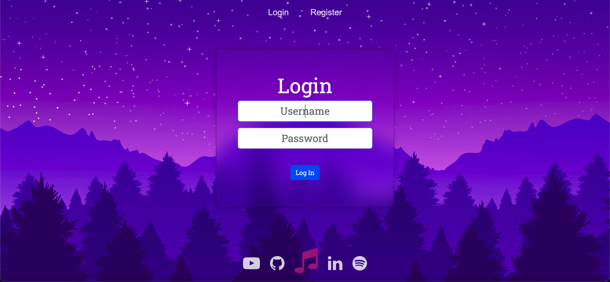
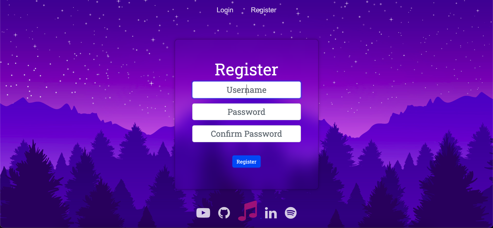
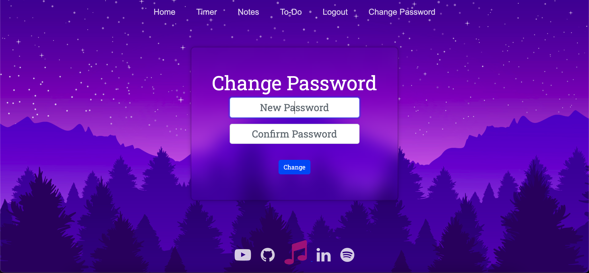
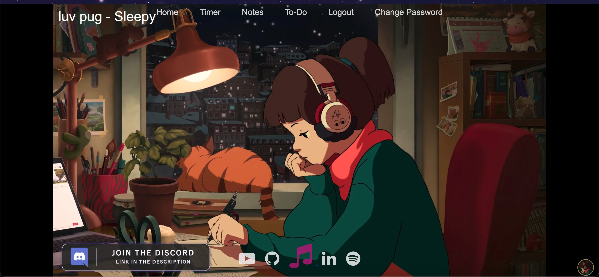

# THETA

## Intro:

Welcome to Theta 👋❤️ ! My attempt at making a web-based platform with all the tools one might need while studying.

## Description:
This project aims to accumulate some of the tools a student might need while studying.

It includes a "to-do list" to keep track of tasks, a notes-taking section, a stopwatch that can track study times, along a link to stream some relaxing background music while studying!

The bottom of the page also contains links to the home pages of some commonly used websites by students.

My motive for creating this project is to gather all the stuff I might need in one place so that I don't waste time opening tabs or different applications for each feature I want to use.

## Details
Theta is a Web-based application coded in Python with Flask (Server side) and styled with HTML5, CSS, JS, and Bootstrap. It implements an SQLite3 database to store the user details, hours of study, to-do list items, and different notes.

The login/registration routes are equipped with a password-hashing system to ensure the security of the user.

Font Used: Roboto-Slab

Font Link: https://fonts.google.com/specimen/Roboto+Slab?query=roboto+slab
## Layout
/templates

    -->layout.html

    Login
    -->login.html
    -->register.html
    -->changepass.html

    Functional
    -->index.html
    -->clock.html
    -->notes.html
    -->todo.html
    -->music.html

    Error
    -->apology.html

app.py -- hosts the server and manages the different routes

helpers.py -- contains helper functions that are used in app.py

### Layout
The "layout.html" file is the template for all the html files in the project, implemented via Jinja Syntax

It contains the basic styles located in /static/styles/general-stylesc.ss, which is used throughout the project

### Login -- login.html
Consists of a form accepting username and password compares it with the database and routes to "/login" route in app.py with the "post" method.

 In case of an invalid input, it displays a relevant message.

## Register -- register.html

Creates a new account accepting username and password/confirmation.
(routes to "/register")

If the username is already taken, it displays the appropriate message
Login Page Background :

On successful registration, the password is hashed securely and saved in the "users" table of theta.db

## Change Password -- changepass.html
Allows a user once logged in to change their password (routes to "/changepass")

login.html, register.html, and changepass.html all three use the same set of styles /static/styles/login-styles.css

## Index -- index.html
The landing page of the project. (parent route)

If there is no active session, it provides options to login/register
In case of an active session, it displays the navbar with all functionalities.

Index Page Bg: https://wallpapercave.com/wp/wp5249546.jpg

## Stopwatch -- clock.html
Provides a stopwatch coded in JS and styled with HTML and CSS to track the hours studied by the user. (routes to "/timer")
The user can start/pause/reset the timer whenever required

The top of the page consists of a selector menu, where we can set a "goal" for ourselves and try to stick to it as much as possible

Javascript: /static/javascript/timer.js
Styles: /static/styles/clock-styles.css

Once the reset button is clicked, the time is saved to "studytimes" table in theta.db, the HMS values are accessed via javascript, and a POST request is sent to the flask backend by AJAX

It also provides a table containing the top 10 longest times the user studied, to provide a way to track the hours.

Timer Page Bg :
https://c4.wallpaperflare.com/wallpaper/908/34/383/lofi-digital-anthro-hd-wallpaper-preview.jpg

### Notes (notes.html)
Create beautiful notes with the notes section of Theta!

Make a new note by clicking on the green note typing the contents, and press ENTER or the + button.
On pressing ENTER, a post request is sent to route "/notes" causing the note to be added to the "notes" table in theta.db

The page is made responsive by using CSS grids and media queries causing the content to adjust its size with changing screen size.

Each note has an option to delete the note, removing it from the database

### Todo (todo.html)
A dedicated place to create, manage, and remove tasks for the day!
Add a new task by writing into the blue box and pressing ENTER.

Each item is associated with a table column called 'status' with the default value "NOT DONE"

Each task item consists of a check and a trash button. When you complete the task, clicking the check button will update the status to "DONE" and cause the item to be struck off(using JS).

Clicking the Trashcan will permanently delete the to-do item from the database.

Todo Page Bg : https://wallpaperaccess.com/full/8891547.jpg

### Music (music.html)
The footer of the page consists of a redirect to the notes page of the server along with commonly used links of YouTube, Spotify and GitHub.

The page consists of the YouTube Player for the Lo-Fi livestream for some soothing background music during those long coding sessions!

Lo-Fi Girl: https://lofigirl.com/
Stream: https://www.youtube.com/watch?v=jfKfPfyJRdk

## Design Decisions
1) ### Music
While implementing the music feature, the original vision I had in mind was to incorporate a player in the layout of each site that would somehow connect to the YouTube live stream and stream music.

However, I did not find any reliable API from the official Lo-Fi website for the same, and it was against YouTube API policies to hide any part of the video being played, so it was impossible to only stream the audio like I wished to.

The Spotify playback version is only enabled for premium users, causing me to turn to Spotify embeds. The problem I faced with those was that the embeds only played the previews of each song and didn't provide a good user experience.

Ultimately, I decided to add a music link in the footer of the page that would redirect me to a site playing the live stream itself so that we wouldn't have to open YT separately, and the user could enjoy the live stream itself.

2) Notes

I decided to go with grids for the notes tab instead of Flexbox because it seemed easier to implement and style with CSS and media queries, as Flexbox was relatively new to me at the time.

## How to Install/Run

1) Clone Git Repository

2) Navigate to directory

3) Run <code>pip install -r requirements.txt</code> in terminal

4) Run <code>python3 app.py</code> OR <code>flask run</code>
in terminal

5) Open the server link
